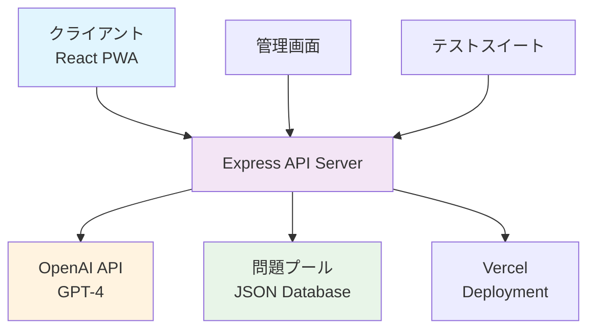

# 📚 カリタス中高向け AI学習アプリ 仕様書

## 🎯 プロジェクト概要

### アプリケーション名
**カリタス中学校 AI試験対策ツール**（完全AI搭載版）

### 対象ユーザー
- **メインターゲット**: カリタス中学校・高等学校の生徒
- **学年範囲**: 中学1年生〜高校1年生
- **利用シーン**: 定期試験対策、日常学習、復習

### 教材準拠
- **数学**: 体系数学（数研出版）完全準拠
- **英語**: Progress 21（エデック）完全準拠

## 🏗️ システム全体構成

### 技術スタック
```
Frontend:
├── React 18 (コンポーネントベース)
├── Tailwind CSS (ユーティリティファーストCSS)
├── Babel (JSX変換)
└── PWA対応 (Service Worker)

Backend:
├── Express.js (Node.js Webフレームワーク)
├── OpenAI API (GPT-4による問題生成)
├── CORS & Helmet (セキュリティ)
└── 問題プールシステム (JSON Database)

Testing:
├── Jest (テストフレームワーク)
├── Supertest (HTTPアサーション)
└── 3層テスト (Unit・Integration・E2E)

Deployment:
├── Vercel (フロントエンド・サーバーレス)
└── Docker対応予定
```

### アーキテクチャ図


## 📖 学習機能詳細仕様

### 1. 数学学習システム

#### 🎯 学習対象・範囲
```
中学1年:
├── 正負の数 (基礎/標準/応用/発展)
├── 文字式
├── 一次方程式
└── 比例・反比例

中学2年:
├── 式の計算
├── 連立方程式
├── 一次関数
├── 図形の性質・合同
├── 確率
└── 三平方の定理

中学3年:
├── 式の展開・因数分解
├── 平方根
├── 二次方程式
├── 二次関数
└── 図形の相似

高校1年:
├── 数と式
├── 集合と命題
├── 二次関数
└── 図形と計量
```

#### 🤖 AI問題生成システム
**OpenAI GPT-4による高品質問題生成**

**生成パラメータ:**
- 学年指定（中1〜高1）
- 単元指定（全分野対応）
- 難易度指定（基礎/標準/応用/発展）

**問題構造:**
```json
{
  "grade": "学年",
  "unit": "単元名",
  "level": "難易度",
  "problem": "問題文（数式・図表含む）",
  "steps": [
    {
      "step": "ステップ名",
      "content": "解法内容",
      "explanation": "詳細解説",
      "detail": "補足説明・注意点"
    }
  ],
  "answer": "最終解答",
  "hint": "困った時のヒント",
  "difficulty_analysis": "難易度分析",
  "learning_point": "学習ポイント"
}
```

#### 📝 7段階詳細解説システム
**省略なし・思考過程完全再現**

1. **問題理解・条件整理**
   - 問題文の読み取り
   - 与えられた条件の整理
   - 求めるものの明確化

2. **解法の選択と方針決定**
   - 複数の解法から最適選択
   - 選択根拠の論理的説明
   - 効率的アプローチの判断

3. **式の変形・計算の準備**
   - 必要な公式・定理の確認
   - 適用条件の検証
   - 計算準備の整理

4. **計算過程（詳細ステップ）**
   - 一行一行の変形過程
   - 各ステップの理由説明
   - 計算ミス防止のコツ

5. **論理的思考と推論**
   - 結果から結論への論理展開
   - 推論の根拠説明
   - 数学的思考の構築

6. **検算と解の妥当性確認**
   - 複数方法での検算
   - 解の現実性チェック
   - 条件満足の確認

7. **まとめと応用・発展**
   - 解答プロセスの総括
   - 類似問題への応用
   - 発展的学習への橋渡し

#### 📚 問題プールシステム
**即座に高品質問題を提供**

**データ構造:**
```
問題プール/
├── 学年別/
│   ├── 単元別/
│   │   ├── 難易度別/
│   │   │   └── 問題配列[]
│   └── 統計情報
└── メタデータ
```

**機能:**
- ランダム問題選択
- 学習履歴追跡
- 問題重複回避
- パフォーマンス分析

### 2. 英語学習システム

#### 📚 英単語学習
**Progress 21完全準拠**

**実装済み機能:**
- AI単語生成（GPT-4）
- 語源・発音・例文付き
- レベル別出題
- 学習履歴管理

**学習要素:**
```json
{
  "word": "英単語",
  "meaning": "日本語意味",
  "pronunciation": "発音記号",
  "etymology": "語源解説",
  "examples": [
    {
      "sentence": "英語例文",
      "translation": "日本語訳"
    }
  ],
  "synonyms": ["類義語配列"],
  "level": "難易度"
}
```

#### 🎯 英語試験機能（計画中）

**4択問題システム:**

1. **英単語意味選択**
   ```
   Question: "elaborate"の意味は？
   A) 簡単な
   B) 詳細な ←正解
   C) 高価な
   D) 古い
   ```

2. **日本語→英語選択**
   ```
   Question: "詳細な"の英語は？
   A) simple
   B) elaborate ←正解
   C) expensive
   D) ancient
   ```

**穴埋め問題システム:**
```
I need to _____ this point in detail.
A) elaborate ←正解
B) simple
C) expensive
D) ancient
```

**翻訳選択システム:**

1. **英日翻訳**
   ```
   "He elaborated on his theory."
   A) 彼は理論を簡略化した
   B) 彼は理論を詳しく説明した ←正解
   C) 彼は理論を否定した
   D) 彼は理論を忘れた
   ```

2. **日英翻訳**
   ```
   "彼は詳しく説明した"
   A) He simplified it
   B) He elaborated on it ←正解
   C) He denied it
   D) He forgot it
   ```

## 🔧 管理機能

### 問題プール管理画面
**教師・管理者向け機能**

**主要機能:**
- AI問題一括生成（1〜20問）
- プール追加・管理
- 統計情報表示
- 問題品質チェック

**生成パラメータ:**
- 科目選択（数学/英語）
- 学年指定（中1〜高1）
- 単元指定（全分野対応）
- 難易度指定（4段階）
- 生成数指定（1〜20問）

## 📊 データ構造・管理

### 問題プールデータベース
**JSON形式での効率的データ管理**

```json
{
  "math": {
    "学年": {
      "単元": {
        "難易度": [
          {
            "id": "問題ID",
            "問題データ": "...",
            "created_at": "作成日時",
            "stats": "使用統計"
          }
        ]
      }
    }
  },
  "english": {
    "同様の構造"
  },
  "stats": {
    "total_problems": "総問題数",
    "problems_by_grade": "学年別統計",
    "problems_by_level": "難易度別統計"
  }
}
```

### 学習履歴管理
**ローカルストレージによる進捗追跡**

```javascript
{
  "mathProgress": {
    "solved": "解答済み問題数",
    "totalTime": "累計学習時間",
    "byGrade": "学年別進捗",
    "byUnit": "単元別進捗"
  },
  "englishProgress": {
    "words": "学習済み単語数",
    "accuracy": "正解率",
    "streaks": "連続正解記録"
  }
}
```

## 🎨 UI/UX設計

### デザイン原則
- **レスポンシブデザイン**: スマホ・タブレット・PC対応
- **直感的操作**: 中高生が迷わないシンプル設計
- **学習効率重視**: 最短距離での問題アクセス
- **視覚的フィードバック**: 進捗・成果の可視化

### 主要画面構成

#### 1. メイン画面
```
📱 スマートフォン表示
┌─────────────────────┐
│ 🤖 カリタスAI学習    │
│                     │
│ 📊 AI + プール      │
│ ┌─────────────────┐ │
│ │ 🧮 数学学習      │ │
│ │ AI問題+詳細解説  │ │
│ │ 解答: 0問        │ │
│ └─────────────────┘ │
│ ┌─────────────────┐ │
│ │ 📚 英単語学習    │ │
│ │ Progress21準拠   │ │
│ │ 学習: 0語        │ │
│ └─────────────────┘ │
│ ┌─────────────────┐ │
│ │ ⚙️ 管理画面       │ │
│ │ 問題プール管理   │ │
│ └─────────────────┘ │
└─────────────────────┘
```

#### 2. 数学学習画面
```
📖 問題表示
┌─────────────────────────────┐
│ 🎯 学習セッション中          │
│ 中2 | 一次関数 | 基礎レベル   │
│                             │
│ 📚 プール問題 - 中2 一次関数 │
│ [基礎レベル]                │
│                             │
│ 問題: y = 2x + 3のグラフが... │
│ 💡 ヒント: x軸との交点は...  │
│                             │
│ [🧠 AI詳細解説を見る]        │
│ [🔄 次の問題を取得]          │
└─────────────────────────────┘
```

#### 3. 解説表示システム
```
🤖 AI詳細解説（7段階）
┌─────────────────────────────┐
│ [1理解][2方針][3準備][4計算] │
│ [5推論][6検算][7まとめ]      │
│                             │
│ 1. 問題理解・条件整理        │
│ ┌─────────────────────────┐ │
│ │ 📝 内容: 問題文から...   │ │
│ │ 💡 解説: なぜこの情報が... │ │
│ │ 🔍 詳細: 見落としがちな... │ │
│ └─────────────────────────┘ │
│                             │
│ [⬅️ 前] [次 ➡️]             │
└─────────────────────────────┘
```

### カラーパレット
```css
:root {
  --primary-blue: #3B82F6;     /* メイン */
  --secondary-purple: #8B5CF6; /* アクセント */
  --success-green: #10B981;    /* 成功・正解 */
  --warning-orange: #F59E0B;   /* 注意・応用 */
  --error-red: #EF4444;        /* エラー・発展 */
  --neutral-gray: #6B7280;     /* テキスト */
  --background-light: #F9FAFB; /* 背景 */
}
```

## 🔒 セキュリティ・パフォーマンス

### セキュリティ対策
- **Helmet.js**: セキュリティヘッダー設定
- **CORS設定**: 適切なオリジン制御
- **入力値検証**: XSS・インジェクション対策
- **API制限**: レート制限・タイムアウト設定

### パフォーマンス最適化
- **Compression**: gzip圧縮
- **キャッシュ戦略**: 効率的なデータ取得
- **レスポンシブ画像**: デバイス別最適化
- **コード分割**: 遅延読み込み実装

## 🧪 テスト戦略

### 3層テスト構成
```
テスト構成/
├── Unit Tests/
│   ├── ユーティリティ関数
│   ├── データ処理ロジック
│   └── API関数
├── Integration Tests/
│   ├── API エンドポイント
│   ├── データベース操作
│   └── 外部サービス連携
└── E2E Tests/
    ├── ユーザーフロー
    ├── ブラウザ互換性
    └── レスポンシブ対応
```

### テスト方針
- **カバレッジ目標**: 80%以上
- **自動化**: CI/CDパイプライン統合
- **クロスブラウザ**: Chrome/Firefox/Safari/Edge
- **モバイル対応**: iOS/Android検証

## 📱 PWA機能仕様

### Service Worker実装
- **オフライン対応**: 問題プールのローカルキャッシュ
- **プッシュ通知**: 学習リマインダー機能
- **バックグラウンド同期**: 学習データの自動同期

### インストール可能
- **ホーム画面追加**: ネイティブアプリライク体験
- **起動画面**: カスタムスプラッシュスクリーン
- **アイコン**: 複数サイズ対応

## 🚀 今後の開発ロードマップ

### Phase 1: 基盤強化（完了）
- ✅ AI問題生成システム
- ✅ 問題プール管理
- ✅ 数学詳細解説（7段階）
- ✅ 英単語学習基盤

### Phase 2: 英語機能拡充（進行中）
- 🔄 4択問題システム実装
- 🔄 穴埋め問題機能
- 🔄 翻訳選択問題
- 🔄 英日両方向対応

### Phase 3: 高度な学習機能
- 📋 適応学習システム
- 📋 弱点分析・推奨機能
- 📋 学習計画自動生成
- 📋 成績レポート機能

### Phase 4: 協働学習・管理
- 📋 クラス管理機能
- 📋 教師ダッシュボード
- 📋 学習データ分析
- 📋 保護者向けレポート

### Phase 5: AI高度化
- 📋 個別最適化AI
- 📋 自然言語での質問対応
- 📋 画像・図形問題対応
- 📋 音声読み上げ機能

## 🎯 品質保証・運用

### 品質管理指標
- **応答時間**: API < 3秒
- **可用性**: 99.9%以上
- **精度**: AI生成問題品質チェック
- **ユーザビリティ**: A/Bテスト継続実施

### 運用・保守
- **監視**: リアルタイム性能監視
- **バックアップ**: 問題プール定期バックアップ
- **更新**: セキュリティパッチ適用
- **サポート**: ユーザーフィードバック対応

## 📈 成功指標・KPI

### 学習効果指標
- **問題解答数**: 月間平均解答数
- **継続率**: 週間・月間アクティブユーザー
- **学習時間**: 平均セッション時間
- **理解度**: 正解率向上推移

### 技術指標
- **レスポンス時間**: 平均API応答時間
- **エラー率**: システムエラー発生率
- **稼働率**: サーバー可用性
- **パフォーマンス**: Core Web Vitals指標

## 🔧 開発・デプロイフロー

### 開発環境
```bash
# 開発サーバー起動
npm run dev

# テスト実行
npm test

# ビルド
npm run build

# 本番デプロイ
vercel --prod
```

### CI/CD パイプライン
1. **コード品質チェック**: ESLint、Prettier
2. **テスト実行**: Unit、Integration、E2E
3. **セキュリティスキャン**: 依存関係脆弱性チェック
4. **ビルド**: プロダクションビルド生成
5. **デプロイ**: Vercel自動デプロイ

## 📞 サポート・ドキュメント

### 開発者向け
- **API仕様書**: `/docs/api.md`
- **コーディング規約**: `/docs/coding-standards.md`
- **トラブルシューティング**: `/docs/troubleshooting.md`

### ユーザー向け
- **利用ガイド**: アプリ内ヘルプ機能
- **FAQ**: よくある質問集
- **お問い合わせ**: フィードバック機能

---

## 📝 更新履歴

| バージョン | 日付 | 内容 |
|-----------|------|------|
| v1.0.0 | 2025-07-02 | 初版仕様書作成 |

---

**この仕様書は、カリタス中高向けAI学習アプリの包括的な設計・実装指針を提供します。現在の実装状況と今後の開発計画を明確にし、高品質な教育ツールの継続的改善を支援します。**
